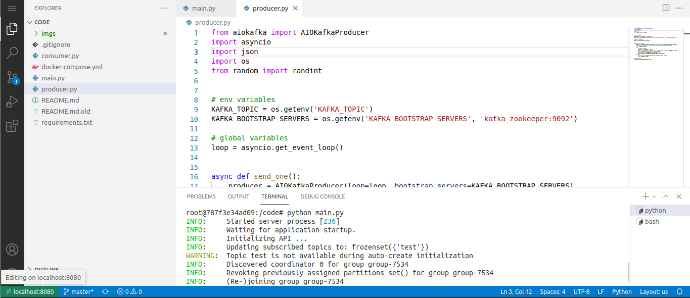

# FastAPI with Kafka Consumer docker-compose
This project is a for of [pedrodeoliveira/fastapi-kafka-consumer](https://github.com/pedrodeoliveira/fastapi-kafka-consumer) in witch I introduce dokcer-compose file to run it with docker as the only dependence.

## How to Run
* run the server
```
docker-compose up

# vscode editor
firefox localhost:8080
# kafka is at localhost:9092
# kafka web view
firefox localhost:3030
```


* on vscode run into a terminal:
```
pip install -r requ}irements.txt
export KAFKA_TOPIC="test"
python main.py
# server running on localhost:8000
```
* run the producer in another terminal
```
export KAFKA_TOPIC="test"
python producer.py
# chech the state
firefox localhost:8000/state
# you can also check on the webserver kafka on TOPICS>test
firefox localhost:3030/kafka-topics-ui/#/cluster/fast-data-dev/topic/n/test/data/topic
```


